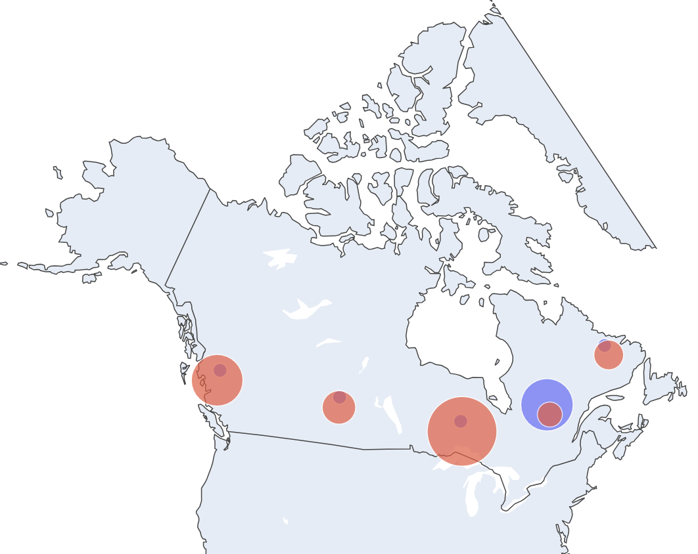

# Canadian Traditional Media Audience Measurement - English vs. French Preferences

### English and French are both official national languages of Canada. 

Despite heavy English influence from the United States, information from the [Canadian 2021 Census](https://www.canada.ca/en/canadian-heritage/services/official-languages-bilingualism/publications/statistics.html) reports **22.0%** of the population speaks French as a first language. **18.0%** of people reported speaking both English and French as a first language.

### Canada's bilingualism can be reflected in media broadcasting patterns across the country.

Preferences for either English or French radio and television in different markets can help us understand audience demographics in different parts of Canada. This information is important because it is used to make business decisions like what content to air, what advertisements to show and what stations to promote.




**Image 1**: A map showing the distribution of English and French broadcasting hours across Canada in 2019. English media is represented by red, French media by blue.


### The rise of streaming and mobile platforms and services has led to concerns about shifting viewer habits.

New technology may be shifting the way that people consume media, including language preferences. Audiences might be straying away from French television and radio in favor of English content in Ontario for example, a province with a global city like Toronto.

### ⭐ **How can we understand what language patterns look like across Canada now?**
**We can get a sense of historical media language preferences across Canada by examining broadcasting language data for traditional radio and television channels.**

By understanding language preferences in traditional media channels like radio and television, in the future we can:
- #### **Predict** language preferences on newer audiovisual platforms based on location
- #### **Compare** future data about audiovisual platform language preferences vs traditional platform language preferences to understand differences (or similarities) in audience
- #### **Investigate** the stability of traditional media in certain regions by examining trends in total broadcasting hours over time

Foundational knowledge about which language Canadians prefer to consume radio and telvision in and where can help us understand how newer technology might affect current user habits.

## Research Questions:
### 📺 What are the differences in English and French language radio and television consumption patterns across Canada per year (2019-2025)? Geographically, which languages dominate and where?

### 📺 Over time how have broadcasting hours for traditional media changed in response to new audiovisual platforms and services?

## Project Structure:
```
├── data/
├── docs/
├── notebooks/
├── src/
├── .gitignore/
├── map_example.png
├── README.md/
└── requirements.txt
```
## Methods:
Notebooks [cleaning.ipynb](notebooks/cleaning.ipynb) and [visualizations.ipynb](notebooks/visualizations.ipynb) were utilized to help answer the research questions.

## Key Findings:

Overall, language preferences across Canada have remained relatively stable from 2019-2025.

### 🍁English radio and television proved to be more popular in all markets except Quebec.

### 🍁English radio and television broadcast hours are **trending down** according to the data collected from 2019-2025.

### 🍁Despite reflecting a smaller total number of broadcast hours, **French** media shows consistent and stable broadcast hours over time.

Despite the presence of new audiovisual platforms and services, the data does not show dramatic shifts in language preferences for each market from year to year. While English media is experiencing a decline in total broadcast hours, French media remains the most stable.


## Acknowledgements:

**Data Source:** [Audience Measurement - Current Trends](https://open.canada.ca/data/dataset/3793028e-96ff-43cc-9281-bfcd83a114a8?utm_source=copilot.com) from the official [open data archives](https://search.open.canada.ca/opendata/) of the Government of Canada.

Tools used:
- **Python** (.csv file I/O, pandas, dataframes)
- **Plotly** and **Pyplot** (scattergeo, trend lines)
- **Jupyter notebook** (code, figures, project structure)

**Maps available here:**

[Canadian Traditional Audience Measurement Maps: 2019-2025](https://rjohns116.github.io/Canadian_Traditional_Media_Audience_Measurement/)

**Trend line chart available here:**

[Canadian Media Consumption Hours Over Time: Trend Line Chart](docs/consumption_hours_over_time.png)


